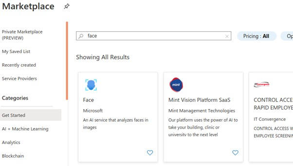
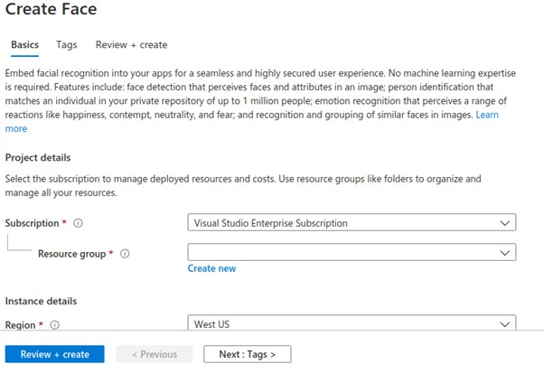
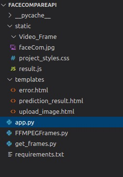

 
# Use Azure Cognitive Services (Face API) to compare a person picture from an ID and compare it with a person from a video. 

## Create a web service for verify the face from the image to video
### First of all, we require the packages to create a web service. Here we are using the flask Web service with python script.
### Prerequisites

●	[Python 3.5+](https://www.python.org/)

●	Flask

●	[Azure Account](https://azure.microsoft.com/en-us/)

●	[Cognitive Services Vision API](https://azure.microsoft.com/en-in/services/cognitive-services/face/)

## Step 1. Create Flask API

1) First, installed the flask library on your machine.

      pip install flask
 
2) After the installation, create a new directory for the flask API and create python file app.py

3) Simple flask hello world code:

      from flask import Flask
      app = Flask(__name__)
      @app.route('/')
      def hello_world():
      return 'Hello, World!'
      
4) Change the directory into Flask API from the git clone project. Now you can run the flask

      flask run

## Step 2. Register a Face API in azure cognitive service

1) Open the Azure portal and go to the “cognitive service” section for registering the azure face API. 

2) Add new service and search the Face and select the “Face” service and create it

 

 

## Step 3. Create a Web Service for face comparison

1) First of all, create a folder and name it your web service name
2) Check below the folder structure for this web service

 

3) Install the required libraries from the web API on your machine:

        pip install Flask==1.1.1
        pip install pandas
        pip install Werkzeug
        pip install scikit-image==0.15.0
        pip install azure-cognitiveservices-vision-face
        
 4) Python code - Before creating a root file of python, we have created a file to convert video into a frame. Create a new file name as “FFMPEGFrames.py” & “get_frames.py” and paste the already shared code.
 
 5) Create a new python file name as “app.py”
 
 6) Import the libraries whichever are using in web service:
 
          import os
          from PIL import Image
          import numpy as np
          import pandas as pd
          import flask
          import werkzeug
          from werkzeug.utils import secure_filename
          from werkzeug.exceptions import HTTPException
          import glob
          import sys
          import requests
          from azure.cognitiveservices.vision.face import FaceClient
          from msrest.authentication 
          import CognitiveServicesCredentials
          
7) Configure Flask web API:

          app = flask.Flask(__name__)app.config['MAX_CONTENT_LENGTH'] = 10 * 1024 * 1024

8) After configuration, declare all the required function with route:

          Def example:
            ///declaration 
            ///code
            return ‘function requirement’ 
          //route
          app.add_url_rule(rule="/upload/", endpoint="upload",view_func=upload_image, methods=["POST"])
9) Create view for rendering the UI:

  a) Create a new “templates” folder in the root of the project
  b) Create a new HTML file inside the templates folder name as “upload_image.html,” “predition_result.html,” and “error.html.”
  c) e.g. create a simple HTML form

          <body>
          <form enctype="multipart/form-data"  method="post" action="/upload">
          

          
          <h3>Upload your current ID card photo and video of your face</h3>
          <label class="lable1" for="imgID">Select ID Card image:</label>
          <input class="input" id ="imgID" type="file" name="image_file" accept="image/*"/> 
          <label class="limit">**Max file limit is 2 MB</label>  
          <label class="lable2" for="vidID">Select mp4 video of person: </label>
          <input class="input2" id="vidID" type="file" name="file"/> 
          <label class="limit">**Max file limit is 5 MB</label>  
          <!-- 
 -->
          <input class="btn" type="submit" value="Verify the face">
          <!-- 
 -->
          

          </form>

10) Style and js code:

  a) Create a new “static” folder in the root of the project.
  b) “Project_styles.css” file creates inside the static folder and pastes the style code.“results.js” for js code
  c) Create a new folder “Video_Frame” for capturing the frame from the video.
  
### Step 4. Execute the code

Open the terminal the root folder of project and, now you can run the flask through the below script.

        flask run
        
After successfully run the flask, you can see the flask server is running on http://127.0.0.1:5000/

Open the browser and hit the above URL.

## Helpful resources

[Microsoft Face detection and attributes](https://docs.microsoft.com/en-us/azure/cognitive-services/face/concepts/face-detection)

[Build a rest API using Flask](https://www.geeksforgeeks.org/python-build-a-rest-api-using-flask/)

[Flask quick start guide](https://flask.palletsprojects.com/en/1.1.x/quickstart/)
