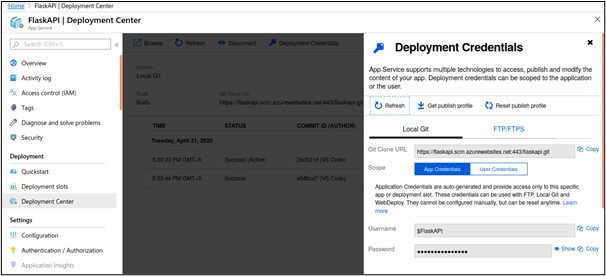

 

# [Click here to try it out](http://faceverify.azurewebsites.net/)

# Face Verification from the ID-Card and the video using Azure Cognitive Services (Face API)

Face verification is a web-based application in which stakeholders can use this application to verify a user’s identity from the active ID-Card to his/her recorded video and easy to identify user authenticity.

# Solution Architecture

# How it works

1) The stakeholder uploads the image of the ID card and recorded video of the user to identify the authenticity.

2) Image and video stored in the file server of the web app.

3) Video processing through the python script to achieving the image from the video.

4) Saved image of the video to pass into the Cognitive Face Verification API for analyzing the face.

5) The final verification result displayed in the web app.

## Follow the below steps to replicate this in your local environment.

Create a web service for verify the face from the image to video

### First of all, we require the packages to create a web service. Here we are using the flask Web service with python script.

### Prerequisites

●	[Python 3.5+](https://www.python.org/)

●	Flask

●	[Azure Account](https://azure.microsoft.com/en-us/)

●	[Cognitive Services Vision API](https://azure.microsoft.com/en-in/services/cognitive-services/face/)

## Step 1. Create Flask API

1) First, installed the flask library on your machine.

      pip install flask
 
2) After the installation, create a new directory for the flask API and create python file app.py

3) Simple flask hello world code:

      from flask import Flask
      app = Flask(__name__)
      @app.route('/')
      def hello_world():
      return 'Hello, World!'
      
4) Change the directory into Flask API from the git clone project. Now you can run the flask

      flask run

## Step 2. Register a Face API in azure cognitive service

1) Open the Azure portal and go to the “cognitive service” section for registering the azure face API. 

2) Add new service and search the Face and select the “Face” service and create it

 

 

## Step 3. Create a Web Service for face comparison

1) First of all, create a folder and name it your web service name
2) Check below the folder structure for this web service

 

3) Install the required libraries from the web API on your machine:

        pip install Flask==1.1.1
        pip install pandas
        pip install Werkzeug
        pip install scikit-image==0.15.0
        pip install azure-cognitiveservices-vision-face
        
 4) Python code - Before creating a root file of python, we have created a file to convert video into a frame. Create a new file name as “FFMPEGFrames.py” & “get_frames.py” and paste the already shared code.
 
 5) Create a new python file name as “app.py”
 
 6) Import the libraries whichever are using in web service:
 
          import os
          from PIL import Image
          import numpy as np
          import pandas as pd
          import flask
          import werkzeug
          from werkzeug.utils import secure_filename
          from werkzeug.exceptions import HTTPException
          import glob
          import sys
          import requests
          from azure.cognitiveservices.vision.face import FaceClient
          from msrest.authentication 
          import CognitiveServicesCredentials
          
7) Configure Flask web API:

          app = flask.Flask(__name__)app.config['MAX_CONTENT_LENGTH'] = 10 * 1024 * 1024

8) After configuration, declare all the required function with route:

          Def example:
            ///declaration 
            ///code
            return ‘function requirement’ 
          //route
          app.add_url_rule(rule="/upload/", endpoint="upload",view_func=upload_image, methods=["POST"])
9) Create view for rendering the UI:

  a) Create a new “templates” folder in the root of the project
  b) Create a new HTML file inside the templates folder name as “upload_image.html,” “predition_result.html,” and “error.html.”
  c) e.g. create a simple HTML form

          <body>
          <form enctype="multipart/form-data"  method="post" action="/upload">
          

          
          <h3>Upload your current ID card photo and video of your face</h3>
          <label class="lable1" for="imgID">Select ID Card image:</label>
          <input class="input" id ="imgID" type="file" name="image_file" accept="image/*"/> 
          <label class="limit">**Max file limit is 2 MB</label>  
          <label class="lable2" for="vidID">Select mp4 video of person: </label>
          <input class="input2" id="vidID" type="file" name="file"/> 
          <label class="limit">**Max file limit is 5 MB</label>  
          <!-- 
 -->
          <input class="btn" type="submit" value="Verify the face">
          <!-- 
 -->
          

          </form>

10) Style and js code:

  a) Create a new “static” folder in the root of the project.
  b) “Project_styles.css” file creates inside the static folder and pastes the style code.“results.js” for js code
  c) Create a new folder “Video_Frame” for capturing the frame from the video.
  
### Step 4. Execute the code

Open the terminal the root folder of project and, now you can run the flask through the below script.

        flask run
        
After successfully run the flask, you can see the flask server is running on http://127.0.0.1:5000/

Open the browser and hit the above URL.

## Deploy face compatre web API on Azure

Deploy the web app service on Azure app service. Firstly, to register the app service on the Azure cloud.

### Step 1: Create a subscription:

The creation of a web app on app services, select your subscription plan with the resource group. In the Name section, give your API name, which you want it.

We are using the code file for the python 3.7 Linux server, so choose the code on the publish column with a runtime stack of Python 3.6 of OS Linux. Finally, click on the review+create button. It’ll consume a few minutes to create it.

 

After successfully done, you can check with the URL as the below images for confirmation.

 

### Step 2: Deployment Setup:

Now, open your azure account and find the app service we have already created for the deployment. Then go to the deployment center tab and continue with the selection of local Git.

 

On the next screen, continue with the selection of the App Service build service section.

 

At last, click on the Deployment credentials tab for getting the username and password of the local Git. and saved on the text file, we’ll use it for authentication on deployment time.

 

### Setp 3: Deploy on Azure App Services:
Go to the project directory on the terminal and run the below command to deploy the local project into azure. After running the last command($ git push azure master), it’ll ask the username & password, kindly provide the username & password, which we already saved on the text file.

            git init
            git add 
            git commit -m 'Initial commit'
            git remote add azure https://flaskapi.scm.azurewebsites.net:443/flaskapi.git
            git push azure master

On the below screenshot, we can verify the code deployed successfully            

 

### Step 4: Start-up command:

Add the below command on the startup command section of the configuration tab.

            gunicorn — bind=0.0.0.0 — timeout 600 app:app
            
 

### Step 5: Step 5: Environment ready of Azure web service via SSH shell:

Open the SSH tab on the azure and change the root directory (cd ..)

 

             cd ..
             source antenv3.6/bin/activate
             pip install ffmpeg

Finally, we deployed the flask API on azure. Click the below URL for confirmation. The URL is different in your case.

## Helpful resources

[Microsoft Face detection and attributes](https://docs.microsoft.com/en-us/azure/cognitive-services/face/concepts/face-detection)

[Build a rest API using Flask](https://www.geeksforgeeks.org/python-build-a-rest-api-using-flask/)

[Flask quick start guide](https://flask.palletsprojects.com/en/1.1.x/quickstart/)
